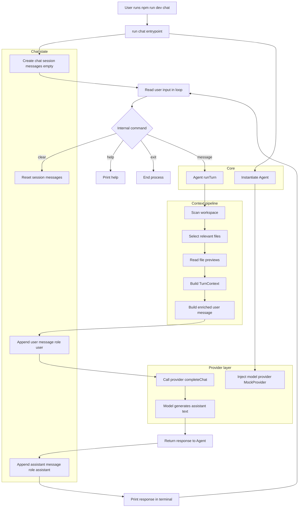

# rei

REI is a minimal personal AI agent CLI built with TypeScript and Node.js. It provides a simple, extensible foundation for running AI-powered tasks from the command line.

## Install dependencies

```bash
npm install
```

## Commands

### `plan` — one-shot task breakdown

```bash
npm run dev -- plan "create a worktree helper CLI"
```

Sends a single prompt to the model and prints the response.

### `chat` — interactive session

```bash
npm run dev -- chat
```

Starts a persistent conversation loop. Type any message and press Enter to get a response. The full conversation history is kept in memory for the duration of the session.

## Model provider

REI supports two providers selected via environment variable:

- `MODEL_PROVIDER=mock` (default)
- `MODEL_PROVIDER=ollama`

### Ollama setup

1. Install Ollama (Linux/macOS):

```bash
curl -fsSL https://ollama.com/install.sh | sh
```

2. Start Ollama server (usually starts automatically after install):

```bash
ollama serve
```

3. Pull a model:

```bash
ollama pull llama3.2
```

4. Run REI with Ollama:

```bash
MODEL_PROVIDER=ollama OLLAMA_MODEL=llama3.2 npm run dev -- chat
```

Optional configuration:

- `OLLAMA_BASE_URL` (default: `http://127.0.0.1:11434`)
- `OLLAMA_MODEL` (default: `llama3.2`)

Example with explicit base URL:

```bash
MODEL_PROVIDER=ollama OLLAMA_BASE_URL=http://127.0.0.1:11434 OLLAMA_MODEL=llama3.2 npm run dev -- plan "summarize this repo"
```

#### ⌨️ CLI Commands

| Command          | Description                                             |
|------------------|---------------------------------------------------------|
| `/help`          | Show available commands                                 |
| `/clear`         | Clear conversation history                              |
| `/exit`          | End the session                                         |
| `/mode ask`      | Switch to ask mode (explanation and Q&A)                |
| `/mode planning` | Switch to planning mode (analysis and implementation plan) |
| `/mode agent`    | Switch to agent mode (execution-oriented reasoning)     |

## 🧠 Modes

REI supports three modes that shape how the assistant reasons and responds:

- **`ask`** — Explanation mode. REI answers questions and explains code. No planning or execution mindset unless explicitly requested.

- **`planning`** — Analysis and plan mode. REI analyzes the codebase, identifies relevant parts, and proposes a step-by-step implementation plan. No execution simulation.

- **`agent`** — Execution-oriented reasoning mode. REI thinks like a coding agent: it describes actions to inspect, modify, and validate code, and produces an operational execution plan. Files are not modified at this stage.

The active mode can be changed at any time during a chat session with `/mode <mode>`.

## 🗂️ Repository-aware context

On every user turn, REI builds contextual information from the local workspace and enriches the prompt before calling the model.

### How it works

1. **Workspace scanning** — REI scans the workspace recursively (capped at 200 files) and collects file metadata. Binary files, lock files, and directories like `node_modules`, `.git`, `dist`, `build`, `coverage`, `.next`, and `out` are automatically ignored.

2. **Relevant file selection** — REI scores every scanned file against the user's message using a simple heuristic: keyword matches in the filename score highest, path matches score lower, and the active mode applies a small boost (source files for `agent`/`planning`, docs for `planning`).  The top 8 files are selected.

3. **Partial file previews** — Each selected file is read up to a 1500-character preview. Truncated files are labelled so the model knows the content was cut.

4. **Prompt enrichment** — The original user message is replaced with an enriched version that includes:
   - the original task
   - the workspace path
   - a brief repo summary (project markers, top-level folders, total files scanned)
   - a list of relevant files with their scores and previews

Context is **regenerated on every turn** — it is a function of `(userInput, mode, session, workspace)`, not a one-time snapshot.

### Debug output

Each turn prints a brief debug summary to the console:

```
[REI debug] Workspace: /path/to/project
[REI debug] Relevant files selected: 3
  - src/core/agent.ts (score: 6)
  - src/prompts/prompt-builder.ts (score: 4)
  - README.md (score: 2)
```

### Current limitations

- No embeddings or semantic search yet — file selection is purely heuristic
- No persistent repository index — the workspace is scanned fresh on every turn
- No file writing or command execution yet
- No provider fallback/retry policy yet (errors are surfaced directly)

### Next planned step

Integrate Ollama as the real model provider once repository-aware context is validated.

---

## ✂️ Message trimming

REI stores the **full conversation history** in `session.messages` for the duration of a session. However, only a **trimmed message window** is sent to the model provider on each turn.

### Why this matters

Repository-aware context (workspace summary + file previews) is re-injected into every user message. Without trimming, the prompt sent to the model would grow linearly with the number of turns, quickly exceeding the context window of local models like Ollama.

### How it works

Before calling `provider.completeChat`, the agent passes `session.messages` through `buildMessagesForModel` (defined in `src/chat/message-builder.ts`):

- The **system message** at index 0 is always preserved.
- Only the **last 10 non-system messages** are kept (configurable via `maxNonSystemMessages`).
- The original `session.messages` array is **never mutated** — full history is retained internally.
- Repository context is **recalculated per turn**, so trimming older messages does not lose workspace grounding.

This is especially important before integrating Ollama or other local models that have limited context windows.

---

## 🧱 Prompt System

The system prompt sent to the model is built by `src/prompts/prompt-builder.ts` and is composed of two parts:

- **Base instructions** — Applied in every mode. Establish REI's identity as a repository-aware assistant, enforce grounding (only use provided context), prohibit hallucination of files or APIs, and require clarity and technical precision.

- **Mode instructions** — Appended after the base instructions. Describe the goals, reasoning style, and constraints specific to the active mode (`ask`, `planning`, or `agent`).

The composed message is produced by `buildSystemMessage(mode)` and is always placed at index 0 of the conversation history so the model always sees the current mode context.

## Type check

```bash
npm run check
```

## Technical notes

### Design decisions

- **`ChatMessage` / `ChatSession` types** (`src/chat/types.ts`): A shared message structure with `role` (`system | user | assistant`) and `content` enables history-aware conversations and is compatible with standard LLM chat APIs.

- **`ModelProvider` interface** (`src/providers/model-provider.ts`): Extended with `completeChat(messages: ChatMessage[]): Promise<string>` alongside the existing `complete(prompt: string)`. The `complete` method is preserved so the `plan` command and any existing code keep working unchanged.

- **`Agent.runTurn`** (`src/core/agent.ts`): Now builds a `TurnContext` via `buildTurnContext` before appending the user message. The raw input is replaced by an enriched message (task + workspace summary + relevant file previews). The system message, session history, and `ModelProvider.completeChat` contract are unchanged.

- **`buildTurnContext`** (`src/context/context-builder.ts`): Orchestrates scanning → selection → preview reading and returns a `TurnContext` object used to enrich the prompt.

- **`scanWorkspace`** (`src/workspace/workspace-scanner.ts`): Recursively walks the workspace, skipping ignored directories and binary/unhelpful file extensions, capped at 200 files.

- **`selectRelevantFiles`** (`src/workspace/file-selector.ts`): Scores files by keyword/filename/path matching against the user input, with small mode-specific boosts. Returns up to 8 ranked files.

- **`readFilePreview`** (`src/workspace/file-preview.ts`): Reads file content up to 1500 characters, truncating safely if needed.

- **`MockProvider.completeChat`** (`src/providers/mock-provider.ts`): Echoes the last user message so the chat loop works without any real model.

### Chat flow (main runtime)



### Adding an `OllamaProvider` later

Create a new class that implements `ModelProvider`:

```typescript
import type { ModelProvider } from "./model-provider.js";
import type { ChatMessage } from "../chat/types.js";

export class OllamaProvider implements ModelProvider {
  async complete(prompt: string): Promise<string> {
    return this.completeChat([{ role: "user", content: prompt }]);
  }

  async completeChat(messages: ChatMessage[]): Promise<string> {
    // POST to http://localhost:11434/api/chat with { model, messages }
    // and return response.message.content
    throw new Error("Not yet implemented");
  }
}
```

Then swap `MockProvider` for `OllamaProvider` in `run-cli.ts` — no other changes needed.

## 📝 Documentation rule

When core behaviors change (modes, prompt system, context, tools), the README must be updated accordingly.
