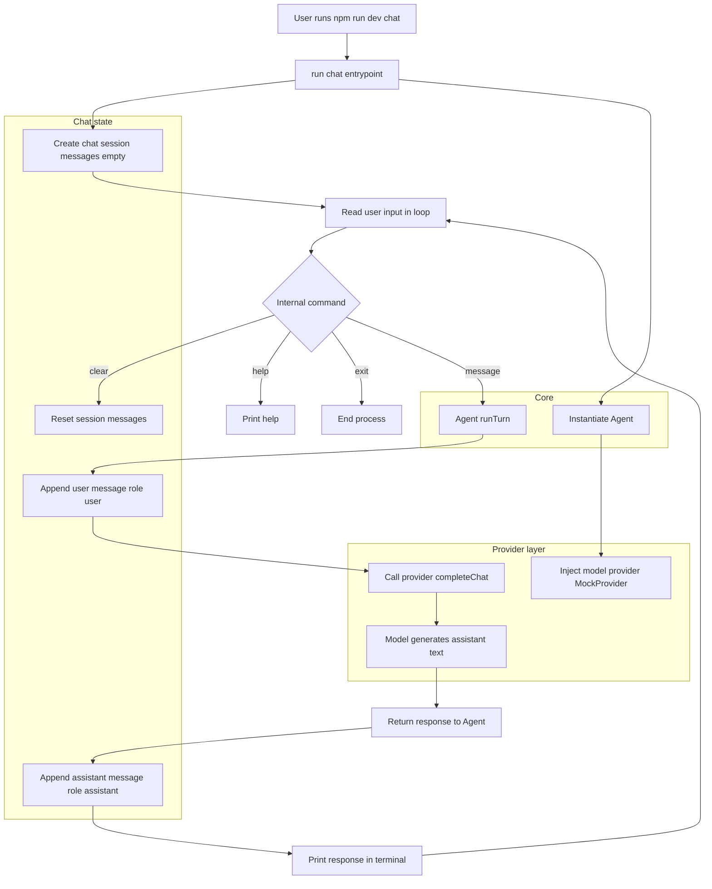

# rei

REI is a minimal personal AI agent CLI built with TypeScript and Node.js. It provides a simple, extensible foundation for running AI-powered tasks from the command line.

## Install dependencies

```bash
npm install
```

## Commands

### `plan` — one-shot task breakdown

```bash
npm run dev -- plan "create a worktree helper CLI"
```

Sends a single prompt to the model and prints the response.

### `chat` — interactive session

```bash
npm run dev -- chat
```

Starts a persistent conversation loop. Type any message and press Enter to get a response. The full conversation history is kept in memory for the duration of the session.

#### ⌨️ CLI Commands

| Command          | Description                                             |
|------------------|---------------------------------------------------------|
| `/help`          | Show available commands                                 |
| `/clear`         | Clear conversation history                              |
| `/exit`          | End the session                                         |
| `/mode ask`      | Switch to ask mode (explanation and Q&A)                |
| `/mode planning` | Switch to planning mode (analysis and implementation plan) |
| `/mode agent`    | Switch to agent mode (execution-oriented reasoning)     |

## 🧠 Modes

REI supports three modes that shape how the assistant reasons and responds:

- **`ask`** — Explanation mode. REI answers questions and explains code. No planning or execution mindset unless explicitly requested.

- **`planning`** — Analysis and plan mode. REI analyzes the codebase, identifies relevant parts, and proposes a step-by-step implementation plan. No execution simulation.

- **`agent`** — Execution-oriented reasoning mode. REI thinks like a coding agent: it describes actions to inspect, modify, and validate code, and produces an operational execution plan. Files are not modified at this stage.

The active mode can be changed at any time during a chat session with `/mode <mode>`.

## 🧱 Prompt System

The system prompt sent to the model is built by `src/prompts/prompt-builder.ts` and is composed of two parts:

- **Base instructions** — Applied in every mode. Establish REI's identity as a repository-aware assistant, enforce grounding (only use provided context), prohibit hallucination of files or APIs, and require clarity and technical precision.

- **Mode instructions** — Appended after the base instructions. Describe the goals, reasoning style, and constraints specific to the active mode (`ask`, `planning`, or `agent`).

The composed message is produced by `buildSystemMessage(mode)` and is always placed at index 0 of the conversation history so the model always sees the current mode context.

## Type check

```bash
npm run check
```

## Technical notes

### Design decisions

- **`ChatMessage` / `ChatSession` types** (`src/chat/types.ts`): A shared message structure with `role` (`system | user | assistant`) and `content` enables history-aware conversations and is compatible with standard LLM chat APIs.

- **`ModelProvider` interface** (`src/providers/model-provider.ts`): Extended with `completeChat(messages: ChatMessage[]): Promise<string>` alongside the existing `complete(prompt: string)`. The `complete` method is preserved so the `plan` command and any existing code keep working unchanged.

- **`Agent.runTurn`** (`src/core/agent.ts`): Appends the user message to the session, calls `completeChat`, and appends the assistant reply. All state lives in the `ChatSession` passed by the caller — the agent itself is stateless.

- **`MockProvider.completeChat`** (`src/providers/mock-provider.ts`): Echoes the last user message so the chat loop works without any real model.

### Chat flow (main runtime)



### Adding an `OllamaProvider` later

Create a new class that implements `ModelProvider`:

```typescript
import type { ModelProvider } from "./model-provider.js";
import type { ChatMessage } from "../chat/types.js";

export class OllamaProvider implements ModelProvider {
  async complete(prompt: string): Promise<string> {
    return this.completeChat([{ role: "user", content: prompt }]);
  }

  async completeChat(messages: ChatMessage[]): Promise<string> {
    // POST to http://localhost:11434/api/chat with { model, messages }
    // and return response.message.content
    throw new Error("Not yet implemented");
  }
}
```

Then swap `MockProvider` for `OllamaProvider` in `run-cli.ts` — no other changes needed.

## 📝 Documentation rule

When core behaviors change (modes, prompt system, context, tools), the README must be updated accordingly.
