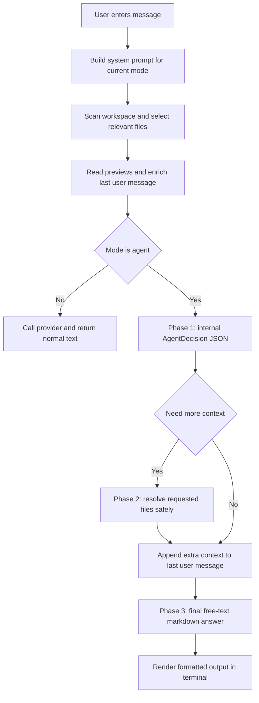

# rei

REI is a repository-aware AI CLI built with TypeScript and Node.js.
It supports question answering, planning, and an agent-style workflow that can ask for more repository context before producing a final answer.

## Install

```bash
npm install
```

## Commands

Global option:

- `--workspace <path>`: target workspace REI should analyze. Defaults to the current working directory.

### `plan` — one-shot planning

```bash
npm run dev -- plan "create a worktree helper CLI"
```

With explicit workspace:

```bash
npm run dev -- --workspace /workspaces/another-repo plan "create a worktree helper CLI"
```

### `chat` — interactive session

```bash
npm run dev -- chat
```

With explicit workspace:

```bash
npm run dev -- --workspace /workspaces/another-repo chat
```

If only `--workspace` is provided, REI defaults to `chat`:

```bash
npm run dev -- --workspace /workspaces/another-repo
```

### Interactive commands

| Command | Description |
|---|---|
| `/help` | Show available commands |
| `/clear` | Clear conversation history |
| `/exit` | End the session |
| `/mode ask` | Switch to ask mode |
| `/mode planning` | Switch to planning mode |
| `/mode agent` | Switch to agent mode |

## Modes

REI has three response modes:

- `ask`: explanation and Q&A. Returns a normal text answer.
- `planning`: analysis and implementation planning. Returns a normal text answer.
- `agent`: repository-aware agent flow. Internally performs a context decision step, may ask for more file content, and then returns a normal markdown answer.

The active mode can be changed during a chat session with `/mode <mode>`.

## Model providers

Provider selection is controlled by `MODEL_PROVIDER`:

- `MODEL_PROVIDER=mock`
- `MODEL_PROVIDER=ollama`
- `MODEL_PROVIDER=groq`
- `MODEL_PROVIDER=gemini`
- `MODEL_PROVIDER=openrouter`

### Ollama setup

1. Install Ollama:

```bash
curl -fsSL https://ollama.com/install.sh | sh
```

2. Start the server:

```bash
ollama serve
```

3. Pull a model:

```bash
ollama pull llama3.2
```

4. Run REI:

```bash
MODEL_PROVIDER=ollama OLLAMA_MODEL=llama3.2 npm run dev -- chat
```

Optional configuration:

- `OLLAMA_BASE_URL` default: `http://127.0.0.1:11434`
- `OLLAMA_MODEL` default: `llama3.2`

### Gemini setup

1. Create an API key in Google AI Studio.
2. Run REI:

```bash
MODEL_PROVIDER=gemini GEMINI_API_KEY=your-key GEMINI_MODEL=gemini-2.5-flash npm run dev -- chat
```

Optional configuration:

- `GEMINI_API_KEY` required
- `GEMINI_MODEL` default: `gemini-2.5-flash`
- `GEMINI_REQUEST_TIMEOUT_MS` default: `120000`

### OpenRouter setup

1. Create an API key at [openrouter.ai/keys](https://openrouter.ai/keys).
2. Run REI:

```bash
MODEL_PROVIDER=openrouter OPENROUTER_API_KEY=your-key npm run dev -- chat
```

To use a specific model:

```bash
MODEL_PROVIDER=openrouter OPENROUTER_API_KEY=your-key OPENROUTER_MODEL=anthropic/claude-3.5-sonnet npm run dev -- chat
```

Optional configuration:

- `OPENROUTER_API_KEY` required
- `OPENROUTER_MODEL` default: `openai/gpt-4o-mini`
- `OPENROUTER_REQUEST_TIMEOUT_MS` default: `120000`

## Terminal output

The interactive chat renders the final answer as formatted markdown in the terminal:

- headings with ANSI styling
- inline code formatting
- syntax-highlighted code blocks
- preserved markdown structure instead of raw token spam

The spinner still runs while the model is generating, and the final formatted answer is printed when the turn completes.

## Repository-aware context

On every user turn, REI rebuilds repository context and injects it into the last user message before calling the provider.

### Turn context pipeline

1. Scan the workspace.
2. Select the most relevant files for the current input.
3. Read partial previews for those files.
4. Build an enriched user message containing:
   - the original task
   - workspace path
   - repository summary
   - selected file previews

This context is regenerated on every turn. It is not a one-time snapshot.

### Preview sizes

REI uses different preview sizes depending on mode and user intent:

- default: `900` chars
- agent mode: `4000` chars
- explicit content requests: up to `20000` chars in agent mode

Explicit content requests include prompts such as “exact code”, “código exacto”, “full code”, “contenido completo”, or “all functions”.

When a preview is cut, REI appends:

```text
... (truncated)
```

That marker is important for the agent decision step.

## Agent mode: current flow

Agent mode no longer uses a user-visible JSON response contract.
Instead, it runs in three phases:

### Phase 1: internal context decision

REI sends a small internal prompt whose only job is to decide:

- is the currently visible context enough?
- is this an inspection task or a change-planning task?
- which additional files are needed, if any?

The model must return a small internal JSON object:

```json
{
  "ready": false,
  "taskType": "inspection",
  "contextRequests": [
    {
      "path": "src/agent-mode/semantic-validation.ts",
      "reason": "need full code to explain all functions"
    }
  ]
}
```

This object is parsed by `parseAgentDecision()` and is never shown to the user.

If parsing fails, REI sanitizes the response, retries with a repair prompt, and eventually falls back to a safe default that skips context expansion.

### Phase 2: deterministic context resolution

If the decision requests more files, REI resolves them without asking the model to guess paths.

Guardrails applied before any file is injected:

- only files already discovered during workspace scanning are allowed
- sensitive filenames and extensions are denied
- symlink escapes outside the workspace are denied
- duplicate requests are ignored
- file reads are capped

Resolved content is appended to the last user message as additional context.

### Phase 3: final free-text answer

After the extra context is injected, REI performs the final provider call and returns a normal markdown answer.

Important properties of the final phase:

- no top-level JSON contract
- no user-visible orchestration object
- inspection tasks can show exact code from the visible context
- change-planning tasks can describe concrete edits and risks
- the final text is what the terminal renders and what the user sees

In other words:

- the internal JSON exists only to negotiate context
- the visible answer comes from the final free-text provider call

## How REI decides it needs more context

The key signal is whether the currently visible preview is sufficient for the request.

Typical examples where REI should request more context:

- the user asks for exact code and the preview ends with `... (truncated)`
- the user asks to explain all functions in a file but only part of the file is visible
- the user asks for a modification plan that depends on code paths not yet visible

Typical examples where REI should answer immediately:

- the selected previews already include the relevant function or type in full
- the user asks a high-level question that does not require reading a whole file

## Message trimming

REI keeps full chat history in memory, but sends only a reduced window to the provider.

Current limits by mode:

- `ask`: last `10` non-system messages
- `planning`: last `8` non-system messages
- `agent`: last `5` non-system messages

The system message is always preserved.
Repository context is re-injected each turn, so trimming older turns does not remove workspace grounding.

## Prompt system

The main system prompt is built in two different ways:

### Regular modes

For `ask` and `planning`, `buildSystemMessage(mode)` composes:

1. shared base prompt
2. shared response rules
3. mode-specific prompt
4. mode-specific output format

### Agent mode

Agent mode uses two prompts depending on the phase:

- decision phase: shared base prompt + `agent-decision`
- answer phase: shared base prompt + shared response rules + `agent-answer`

This split is what lets REI keep the orchestration contract internal while still returning normal markdown to the user.

## Debug output

Each turn prints a brief context summary, and agent mode also prints internal decision logs.

Example:

```text
[REI debug] Workspace: /path/to/project
[REI debug] Relevant files selected: 3
  - src/core/agent.ts (score: 6)
  - src/prompts/prompt-builder.ts (score: 4)
  - README.md (score: 2)
[REI debug] Agent decision: taskType=inspection, ready=false, contextRequests=[src/foo.ts]
[REI debug] Agent context resolved 1 file(s), injecting into answer phase
```

## Current limitations

- relevant file selection is still heuristic, not semantic
- there is no persistent repository index yet
- there is no file patch application yet
- there is no command execution flow inside REI yet
- context expansion currently reads and injects file content, but does not produce executable edit plans or diffs

## Next step: patch generation with diff output

The next logical step is to keep the current three-phase agent flow and add a fourth internal layer for proposed edits.

A practical direction is:

1. keep Phase 1 as context negotiation
2. keep Phase 2 as deterministic file resolution
3. keep Phase 3 as the final user-facing explanation or plan
4. add an internal patch proposal step that returns a structured edit plan per file
5. compile that plan into a unified diff or git-style patch
6. validate the patch before any future apply step

Suggested shape for that future patch layer:

- internal contract containing target file, intent, and exact before/after snippets
- deterministic diff synthesis on the REI side instead of trusting raw model diffs blindly
- validation with exact-match anchors and optional `git apply --check`
- explicit approval gate before any future write/apply operation

That preserves the current design principle:

- model decides what context it needs
- runtime resolves files safely
- user sees clean markdown output
- future patching stays explicit, reviewable, and deterministic

## Type check

```bash
npm run check
```

## Runtime overview



## Documentation rule

When core runtime behavior changes, update the README in the same change set.
