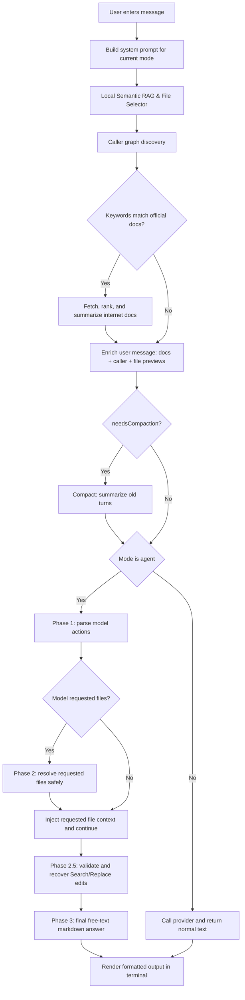
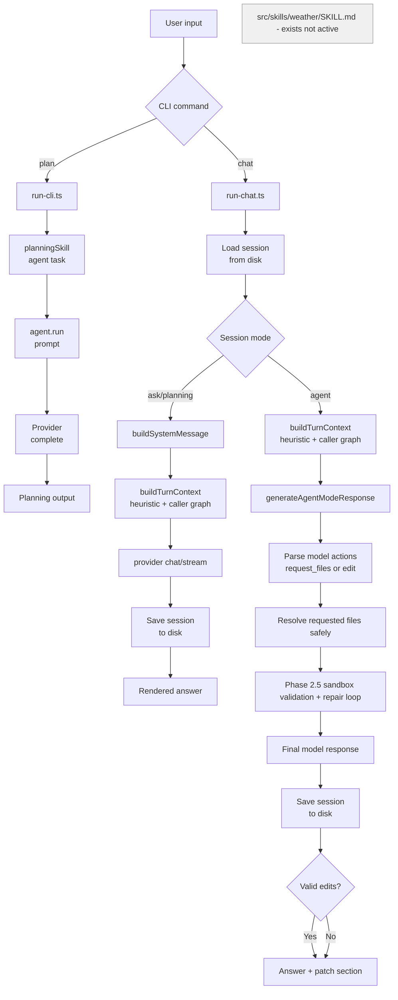

<div align="center">
<pre>
██████╗ ███████╗██╗
██╔══██╗██╔════╝██║
██████╔╝█████╗  ██║
██╔══██╗██╔══╝  ██║
██║  ██║███████╗██║
╚═╝  ╚═╝╚══════╝╚═╝
</pre>
  <h1>REI — Just REI</h1>
  <p><em>A sniper-precision, local-first AI coding agent</em></p>
</div>

[](https://opensource.org/licenses/MIT)

**REI** is a next-generation, compiler-aware AI coding agent built for developers who demand absolute privacy, complete code traceability, and zero-compromise intelligence. Engineered with a unique **hybrid local-first, multi-brain, and multi-provider architecture**, REI adapts dynamically to your needs—running either 100% offline or orchestrating local speed with premium cloud models. Operating as an interactive terminal CLI and a high-performance backend server, it integrates seamlessly into your local workspace and IDE workflows (such as Continue.dev).

---

## 🌟 The Core Pillars of REI

Unlike generic, conversational coding assistants, REI acts as a **surgical developer companion** by combining offline structural understanding with advanced hybrid LLM routing.

### 1. 🧠 Hybrid "Multi-Brain" Architecture (Multi-Cerebro)
REI allows you to configure two powerful operational setups depending on your security, hardware, and intelligence requirements:

* **100% Local Multi-Brain Setup (Fully Private & Offline):**
  Run completely local on your own hardware using Ollama or LM Studio with zero data leakage. Route lightweight conversational turns (Ask/Planning) to fast models like `llama3.2` or `qwen2.5-coder:7b`, while delegating heavy agentic file edits to larger coding models running locally (such as `qwen2.5-coder:14b` or the outstanding **`qwen/qwen3.6-35b-a3b`**).
* **Pro Hybrid Multi-Brain & Multi-Provider Setup (Local Speed + Cloud Power):**
  Combine the speed of local hardware with the surgical capability of state-of-the-art cloud intelligence. Run your everyday chat and architectural planning locally and for free (using local Ollama models), and dynamically route complex XML-based agent edits to premium cloud APIs (such as **`qwen/qwen3.6-plus`** or `anthropic/claude-3.5-sonnet` via [OpenRouter](https://openrouter.ai/)).
* **Hot-Swapping:** Use dynamic chat commands (e.g. `/provider agent openrouter` and `/model agent qwen/qwen3.6-plus`) to adjust routing in real-time without restarting the session.

### 2. 🌲 Surgical AST Intelligence (`ts-morph` & `web-tree-sitter`)
REI doesn't "guess" or rely on flaky regex searches. It parses your codebase's abstract syntax tree natively:
* **TypeScript & JavaScript (God Mode):** Uses `ts-morph` to map classes, functions, and interfaces, automatically performing **Caller Discovery** to find and load all files affected by a symbol change.
* **Polyglot Codebases (Standard Mode):** Incorporates `web-tree-sitter` for advanced structural understanding of Python, Rust, Go, Java, and other languages.

### 3. 🧪 Sandbox Auto-Healing & Compiler-Awareness
REI refuses to break your repository. When executing code changes in Agent Mode:
1. **Isolated Sandbox:** REI creates a temporary directory copy of the workspace to apply edits.
2. **Type & Compilation Checking:** Runs type verification (e.g., `npx tsc --noEmit` for TypeScript).
3. **Optional TDD Loop:** Automatically runs the project's test suite (`npm run test`) to validate functionality.
4. **Auto-Healing:** If the compiler or test suite reports an error, REI feeds the diagnostics back to the LLM for automatic correction, presenting the patch to you only once it compiles flawlessly.

### 4. ⚡ Offline Semantic RAG Engine
REI features an ultra-fast, entirely local Retrieval-Augmented Generation pipeline:
* **Local Embeddings:** Uses the `Xenova/all-MiniLM-L6-v2` ONNX model via `@xenova/transformers` directly in Node.js. Your code is embedded locally on CPU—never sent to cloud APIs.
* **AST-Aware Chunking:** Chunks files by classes, functions, and interfaces rather than character counts.
* **Incremental FS-Watching:** Uses `chokidar` to track file modifications and incrementally update the `.rei/rag-index.json` database in milliseconds.

### 5. 📊 Bulletproof Data Traceability
Every single step REI takes is logged transparently. REI outputs structured telemetry directly to `.rei/logs/agent-flow.jsonl`, detailing:
* Semantic search scores and file ranking.
* Which symbols and caller references were discovered.
* The exact diffs proposed, compilation errors encountered, and sandbox auto-healing cycles.

## 📥 Installation & Scripts Setup

You can install REI globally using our streamlined shell scripts or compile it manually from source.

### 1. Automated Global Installation (via curl)
To install the interactive CLI globally and configure a dedicated symlink launcher inside `~/.local/bin/rei`:

```bash
# Install the CLI globally
curl -fsSL https://raw.githubusercontent.com/lucasaguilar/rei/main/install-rei-cli.sh | bash
```

> [!NOTE]
> Make sure `$HOME/.bashrc` contains: `export PATH="$HOME/.local/bin:$PATH"`

To install the backend server API for VS Code Continue.dev plugin integration, creating a launcher at `~/.rei/rei-server`:

```bash
# Install the backend server API
curl -fsSL https://raw.githubusercontent.com/lucasaguilar/rei/main/install-rei-server.sh | bash
```

> [!NOTE]
> These installers clone the project into `~/.rei`, install Node dependencies, compile the TypeScript code, and generate a global configuration file at `~/.rei/.env`.

### 2. Local Source Installation (For Developers)
To install using your current local working copy:

```bash
# From the root of your cloned repository
./install-rei-cli-local.sh
```

Or manually step-by-step:
```bash
git clone https://github.com/lucasaguilar/rei.git
cd rei
npm install
npm run build
npm install -g .
```

---

## 🚀 Running REI & Execution Cases

REI can be run in three different modes depending on your workflow:

### 1. CLI Interactive Curses UI
Start the full-screen terminal workspace. Highly recommended for tmux and vim power-users:

```bash
# Launch interactive session inside current directory
rei

# Force launch the Interactive Configuration Wizard
rei --config
```

> [!TIP]
> **First-Run Autoconfig:** If you run `rei` and no configuration (`.env` file) is found, REI will automatically start the **Interactive Configuration Wizard** (`launch-rei.js`). The wizard guides you step-by-step to select your workspace, choose your LLM providers and models, adjust context window sizes, and automatically generates and persists your workspace `.env` file so subsequent runs are instant and error-free!

### 2. One-Shot Planning Tasks
For quick, single-command architectural designs and planning tasks:
```bash
rei plan "Design a robust caching decorator for the API service"

# Run planning on another repository
rei --workspace /path/to/another/project plan "Add email notification support"
```

### 3. API Server for IDE Extensions (Continue.dev)
Start the high-performance local server to act as a backend endpoint:
```bash
# Run the compiled server on port 3000
~/.rei/rei-server

# Or run in development mode from source
npm run server:dev
```

---

## 🎮 Practical Use Case: Step-by-Step `/runplan` Cycle

REI excels at executing multi-stage architectural changes. Here is a real-world walkthrough of a complete feature implementation:

### 1. Planning the Feature
Switch to Planning Mode inside the chat to brainstorm and design the implementation:
```text
/mode planning
Plan the implementation of a new state store for market listing indices.
```
REI analyzes the codebase structure using local RAG and AST analysis, then outputs a structured, markdown-compatible design plan divided into distinct milestones (e.g., `### Stage 1: Define Interface`, `### Stage 2: Create Store Service`, etc.).

### 2. Auto-Checklist Generation
As soon as the plan is presented, REI automatically creates an active progress tracking checklist inside your workspace directory at **`.rei/current-plan-todo.md`**:
```markdown
# PLAN PROGRESS
- [ ] **Etapa 1:** Define Interface
- [ ] **Etapa 2:** Create Store Service
```

### 3. Automated Stage Execution
To execute the first stage of the plan, run `/runplan` followed by the target stage:
```text
/runplan stage 1
```
REI will:
1. Transition dynamically to **Agent Mode**.
2. Run **AST Caller Discovery** to identify all files and references affected by the new interfaces.
3. Call your premium agent model (e.g., `qwen/qwen3.6-plus` on OpenRouter) to write/modify the exact code.

### 4. Sandbox auto-healing & Compilation
Before the code is written back to your workspace:
* REI copies the files to an isolated **temporary sandbox**.
* It applies the proposed changes and runs type diagnostics (`npx tsc --noEmit`).
* If typescript compiler errors are found (e.g., a missing export, wrong type cast), REI feeds the exact compiler diagnostic block back to the LLM for **Auto-Healing**.
* Once the edits compile with **zero type errors**, the verified code is cleanly applied to your working directory.

### 5. Automated Checklist Update
Upon successful execution, REI automatically updates your progress file (`.rei/current-plan-todo.md`):
```markdown
# PLAN PROGRESS
- [x] **Etapa 1:** Define Interface
- [ ] **Etapa 2:** Create Store Service
```
You can now continue to the next stage by executing `/runplan stage 2`.

### 💾 6. Plan Persistence & Session Reloading (`/saveplan` & `/loadplan`)

While the temporary active checklist is stored at `.rei/current-plan-todo.md` during execution, you can persist the **entire detailed technical plan** directly into your repository to share it, version control it with Git, or resume it later in a fresh chat session.

#### Persisting a Plan to Disk (`/saveplan`)
Once a solid plan is generated in your chat conversation, save it by running:
```text
/saveplan <name>
```
* This creates a permanent Markdown document at `.rei/plans/<name>.md` containing the complete detailed plan, including observations, risks, and stage details.
* You can commit this file to Git so your team can access the exact implementation recipe.

#### Loading/Resuming a Plan (`/loadplan`)
When you start a new chat session or switch branches, you can reload the saved plan and rebuild the active tracking todo checklist:
```text
/loadplan <name>
```
* **Instant Re-indexing**: REI reads the saved Markdown file from `.rei/plans/<name>.md`, appends it into your current conversation context, and immediately rebuilds/regenerates `.rei/current-plan-todo.md` with all stages marked as pending.
* **Granular Step Execution**: After loading the plan, execute any stage step-by-step using `/runplan stage <n>` (e.g. `/runplan stage 1`). The agent will immediately switch to **Agent Mode** and implement that stage.

> [!TIP]
> **Manual Editing Supported**: Since plans are saved as raw Markdown, you can manually open and edit the `.rei/plans/<name>.md` file inside your IDE to adjust steps or add items. Simply run `/loadplan <name>` again, and REI will dynamically synchronize the active todo checklist with your manual changes!

---

## 🔌 IDE Integration (Continue.dev)

Configure REI as your local-first repository-aware provider inside **Continue** (VS Code / JetBrains):

1. **Start the REI Server:**
   ```bash
   ~/.rei/rei-server
   ```
2. **Configure `config.json` in Continue:**
   Add a custom model pointing to the REI endpoint:
   ```json
   {
     "models": [
       {
         "title": "REI Hybrid",
         "provider": "openai",
         "model": "qwen/qwen3.6-plus",
         "apiBase": "http://localhost:3000/chat/completions"
       }
     ]
   }
   ```

## Workspace resolution

REI resolves the workspace path differently depending on how it runs.

**CLI mode** — workspace is always one of:
- `process.cwd()` (default, no flags) — the directory where you ran `rei chat`
- `--workspace /path/to/repo` — explicit override at launch time

`REI_WORKSPACE_PATH` has no effect in CLI mode.

**Server mode** — two environment variables control workspace access:

- `REI_WORKSPACE_PATH`: the default workspace the server operates on. Falls back to `process.cwd()` if not set.
- `ALLOWED_WORKSPACES`: comma-separated security whitelist. The server rejects any workspace not in this list. Falls back to `process.cwd()` if not set.

```bash
REI_WORKSPACE_PATH=/Users/you/my-project \
ALLOWED_WORKSPACES=/Users/you/my-project,/Users/you/another-project \
rei-server
```

The server validates every incoming request against `ALLOWED_WORKSPACES`. Requests targeting unlisted paths are rejected with a `403`.

### Interactive commands

REI's interactive Curses terminal interface supports slash commands to give you full control over the session state, active plan execution, LLM routing, and memory compaction:

| Command | Description | Example |
|---|---|---|
| `/help` | Show all available commands in terminal UI. | `/help` |
| `/clear` | Clear active conversation history (starts fresh). | `/clear` |
| `/exit` | End the active terminal session and exit. | `/exit` |
| `/mode <mode>` | Switch chat session mode. Supports `ask`, `planning`, or `agent`. | `/mode planning` |
| `/runplan [stage <n>]` | Execute plan step-by-step (transitions to `agent` mode for that stage). | `/runplan stage 1` |
| `/saveplan <name>` | Save the full detailed plan to disk as `.rei/plans/<name>.md`. | `/saveplan feat-auth` |
| `/loadplan <name>` | Load a plan from disk and dynamically sync `.rei/current-plan-todo.md`. | `/loadplan feat-auth` |
| `/tdd` | Toggle TDD mode (runs `npm run test` during sandbox validation of edits). | `/tdd` |
| `/index` | Re-index the codebase and refresh the AST semantic skeleton map. | `/index` |
| `/compact` | Manually compact conversation memory into a high-level summary. | `/compact` |
| `/provider [agent] [name]` | Show active LLM providers or switch them dynamically on-the-fly. | `/provider openrouter` |
| `/model [agent] [name]` | Show active LLM models or switch models dynamically. | `/model agent qwen/qwen3.6-plus` |
| `/session` | Show active session details (creation date, active mode, turns). | `/session` |
| `/session list` | List all archived chat sessions for the current workspace. | `/session list` |
| `/session archive [name]` | Archive the current chat session to disk under a custom or auto name. | `/session archive auth-refactor` |
| `/session load <id>` | Load an archived chat session by ID and restore full context. | `/session load current_2026_05_27` |
| `/session new [name]` | Archive the current session and start a fresh session immediately. | `/session new` |

## Modes

REI has three response modes:

- `ask`: explanation and Q&A. Returns a normal text answer.
- `planning`: analysis and implementation planning. Returns a normal text answer.
- `agent`: repository-aware agent flow. Internally performs a context decision step, may ask for more file content, and then returns a normal markdown answer.

The active mode can be changed during a chat session with `/mode <mode>`.

## ⚙️ Interactive Configuration Wizard & Model Providers

Instead of manually setting up complex environment variables or launch commands, REI features a fully interactive **Configuration Wizard (`launch-rei.js`)** that automates the setup of your model providers and workspace credentials.

### 1. First-Run Auto-Configuration
When you run the `rei` command inside any repository for the first time, REI will detect if there is a `.env` configuration file in that workspace folder.
* **Fallback Wizard**: If no `.env` is found, REI will immediately launch the Interactive Configuration Wizard automatically.
* **Workspace `.env` Generation**: The wizard will read the global `.env.example` template, prompt you for API keys and preferences (Ollama settings, Gemini keys, OpenRouter, etc.), and **automatically generate a custom `.env` file directly inside that active project folder**.
* Subsequent launches of `rei` or `rei chat` inside that repository will immediately load that local configuration, making startup instant and frictionless.

### 2. Re-configuration on Demand (`rei --config`)
If you want to change your provider keys, switch models, or re-configure a workspace at any time, run:
```bash
rei --config
```
This forces the Interactive Wizard to launch, allowing you to update your settings and cleanly overwrite the active `.env` file.

### 3. How the Generated `.env` Looks (Hybrid Model Routing)

When you run the Interactive Configuration Wizard, it reads the template from [`.env.example`](file:///Users/lucas/www/rei/.env.example) and generates a workspace-local `.env` file containing comprehensive comments for every single tuning parameter. 

Below is the **complete `.env.example` configuration template** recommended for high-performance hybrid setups:

```ini
# ==============================================================================
# REI (Repository-Aware AI Agent) - Environment Configuration Example
# ==============================================================================
# Copy this file to .env in your repository root and fill in your desired settings:
# cp .env.example .env
# ==============================================================================

# ------------------------------------------------------------------------------
# 1. PRIMARY ORCHESTRATION & PROVIDERS
# ------------------------------------------------------------------------------

# Main LLM provider for the chat session.
# Supported values: mock, ollama, groq, gemini, openrouter, huggingface, llmstudio
MODEL_PROVIDER=ollama

# (Optional) Dedicated provider used ONLY for AGENT mode execution.
# Allows using a light local provider (e.g., ollama) for fast Ask/Planning turns, 
# while delegating heavier XML-producing actions to a premium cloud model.
# E.g., AGENT_MODEL_PROVIDER=openrouter
AGENT_MODEL_PROVIDER=openrouter


# ------------------------------------------------------------------------------
# 2. CLOUD PROVIDER CREDENTIALS & API KEYS
# ------------------------------------------------------------------------------
OPENROUTER_API_KEY=your_openrouter_api_key_here
GEMINI_API_KEY=your_gemini_api_key_here
GROQ_API_KEY=your_groq_api_key_here
HF_TOKEN=your_huggingface_token_here


# ------------------------------------------------------------------------------
# 3. CLOUD PROVIDER MODEL SELECTION
# ------------------------------------------------------------------------------

# --- OpenRouter Models ---
# Default model for all modes using OpenRouter
OPENROUTER_MODEL=qwen/qwen3-coder-30b-a3b-instruct
# Specific model used only in Agent mode (optional)
# OPENROUTER_MODEL_AGENT=qwen/qwen3.6-plus
OPENROUTER_MODEL_AGENT=qwen/qwen3.6-plus

# --- Gemini Models ---
# Default model for all modes using Gemini
GEMINI_MODEL=gemini-2.5-flash
# Specific model used only in Agent mode (optional)
# GEMINI_MODEL_AGENT=gemini-2.5-pro

# --- Groq Models ---
# Default model for all modes using Groq
GROQ_MODEL=deepseek-r1-distill-llama-70b
# Specific model used only in Agent mode (optional)
# GROQ_MODEL_AGENT=deepseek-r1-distill-llama-70b


# ------------------------------------------------------------------------------
# 4. LOCAL PROVIDER MODEL SELECTION
# ------------------------------------------------------------------------------

# --- Ollama Configuration ---
# Default model used as fallback for all modes using Ollama
OLLAMA_MODEL=qwen2.5-coder:7b

# Mode-specific overrides (optional). If not set, falls back to OLLAMA_MODEL.
# Highly recommended: use the ultra-fast local model qwen/qwen3.6-35b-a3b (via Ollama / LM Studio)
OLLAMA_MODEL_ASK=qwen/qwen3.6-35b-a3b
OLLAMA_MODEL_PLANNING=qwen/qwen3.6-35b-a3b
# OLLAMA_MODEL_AGENT=qwen3.6:27b-coding-nvfp4

# --- LM Studio Configuration (llmstudio) ---
# Supports qwen/qwen3.6-35b-a3b for fast offline reasoning with GPU offloading
LLM_STUDIO_MODEL=qwen/qwen3.6-35b-a3b
# Specific model used only in Agent mode (optional)
# LLM_STUDIO_MODEL_AGENT=qwen/qwen3.6-35b-a3b

# --- Hugging Face Inference API Models ---
HF_MODEL=Qwen/Qwen2.5-Coder-32B-Instruct
# Specific model used only in Agent mode (optional)
# HF_MODEL_AGENT=Qwen/Qwen2.5-Coder-32B-Instruct


# ------------------------------------------------------------------------------
# 5. OLLAMA ENGINE PERFORMANCE TUNING (ADVANCED)
# ------------------------------------------------------------------------------

# Base URL to reach the Ollama API (defaults to http://127.0.0.1:11434)
# OLLAMA_BASE_URL=http://127.0.0.1:11434

# Temperature parameter for local generations.
# 0 is strongly recommended for deterministic, structured coding/XML outputs.
OLLAMA_TEMPERATURE=0

# Total token context window (input + output).
# Standard models: 8192 or 12288 works fine.
# Thinking models (e.g. Qwen 3.6, DeepSeek R1): 16384 to 32768 is recommended to avoid window exhaustion.
OLLAMA_NUM_CTX=16384

# Maximum tokens predicted (generated response length).
# For reasoning/thinking models whose reasoning traces are long, set to 4096 or higher.
OLLAMA_NUM_PREDICT=4096

# Number of CPU threads to allocate for local inference
# OLLAMA_NUM_THREAD=8

# Duration to keep models loaded in Ollama's memory (defaults to 30m)
# OLLAMA_KEEP_ALIVE=2h

# Network request timeout in milliseconds for local Ollama completions (defaults to 300000)
# OLLAMA_REQUEST_TIMEOUT_MS=600000


# ------------------------------------------------------------------------------
# 6. CONTEXT REDUCTION & PERFORMANCE OPTIMIZATIONS
# ------------------------------------------------------------------------------

# Master toggle for on-demand context injection (1 = Enabled, 0 = Disabled).
# When enabled, files are only loaded when explicitly referenced by the user (e.g. @filename),
# keeping prompt context small, fast, and highly resource-efficient for local execution.
REI_ON_DEMAND_FILE_CONTEXT=1

# Mode-specific overrides (optional)
REI_ON_DEMAND_FILE_CONTEXT_ASK=1
REI_ON_DEMAND_FILE_CONTEXT_PLANNING=1
REI_ON_DEMAND_FILE_CONTEXT_AGENT=0


# ------------------------------------------------------------------------------
# 7. WORKSPACE, SERVER & TOOL SETTINGS
# ------------------------------------------------------------------------------

# Default directory path to target upon starting the chat
REI_WORKSPACE_PATH=/path/to/your/default/workspace

# List of authorized directories for the server backend (comma-separated)
# ALLOWED_WORKSPACES=/path/to/project1,/path/to/project2

# Model used specifically to summarize historical messages during session compaction
# COMPACTOR_MODEL=gemini-2.5-flash

# Test-Driven Development (TDD) Mode (true/false)
# If enabled, sandbox execution will run project test suite ('npm run test')
# in addition to type checks to validate proposed edits before presenting them.
REI_TDD_MODE=false

# Code Modification Formatting Scheme (sr | wholefile)
# - sr (default): Emits search-replace tags (<search> / <replace>), highly efficient for large files.
# - wholefile: Emits the complete file replacement within the <edit> tag.
# AGENT_EDIT_FORMAT=sr

# Network request timeout in milliseconds for LM Studio completions
LLM_STUDIO_REQUEST_TIMEOUT_MS=600000
```

---

### 🧠 Fundamental Configurations Explained

To truly understand how REI operates and tune it for your workspace, pay close attention to these key environment switches:

#### A. Multi-Brain Routing Orchestration
* **`MODEL_PROVIDER`**: Controls the provider for conversational turns (`/mode ask` and `/mode planning`). Setting this to `ollama` or `llmstudio` routes standard chat and planning queries locally to keep them 100% free and fast.
* **`AGENT_MODEL_PROVIDER`**: Instructs REI to route **Agent Mode** surgical code modifications to a different provider. Enforcing `AGENT_MODEL_PROVIDER=openrouter` with a premium model like `qwen/qwen3.6-plus` ensures top-tier reasoning capabilities when producing XML search-replace patches, while keeping conversational costs at zero.

#### B. Context Window Tuning for Local Reasoning Models
* **`OLLAMA_NUM_CTX`**: Configures the context size in Ollama. For high-performance local reasoning models (like `qwen/qwen3.6-35b-a3b`), setting this to at least `16384` or `32768` is critical to prevent context truncation during deep repository scans.
* **`OLLAMA_NUM_PREDICT`**: Controls the maximum length of generated outputs. Set this to `4096` or higher when running reasoning models, since their internal thinking chains consume substantial output tokens before emitting the final code.

#### C. Context Reduction & On-Demand Context Injection
* **`REI_ON_DEMAND_FILE_CONTEXT`**: When set to `1`, REI operates in an ultra-efficient on-demand mode. Files are only loaded into the prompt context when explicitly referenced by the user (e.g., using `@filename`). This keeps conversation speeds lightning-fast.
* **`REI_ON_DEMAND_FILE_CONTEXT_AGENT`**: Set to `0` by default. This ensures that when executing a plan in **Agent Mode**, the agent has full access to load whatever files it deems necessary to guarantee type safety and compile diagnostics, while conversation/planning remain lightweight.

#### D. Test-Driven Development Auto-Healing
* **`REI_TDD_MODE`**: Setting this to `true` (or toggling via `/tdd` inside chat) tells REI's sandbox validation loop to execute your project's test suite (`npm run test`) in addition to standard TypeScript compilation diagnostics. Any failing test traces will be fed back to the LLM automatically, enabling REI to auto-heal logical errors before applying edits to your workspace.

REI supports the following model providers out-of-the-box: `ollama`, `openrouter`, `gemini`, `groq`, `llmstudio`, `huggingface`, and `mock`.

### Compactor model (optional)

When conversation memory is compacted, REI can use a separate cheaper model for summarization instead of the main provider model. This is useful when the main model is expensive or slow.

```bash
COMPACTOR_MODEL=openai/gpt-4o-mini rei chat
```

If not set, the compactor uses the same provider and model as the main session.

## Terminal output

The interactive chat runs in a full-screen terminal UI (alternate screen buffer) and renders the final answer as formatted markdown:

- headings with ANSI styling
- inline code formatting
- syntax-highlighted code blocks
- preserved markdown structure instead of raw token spam

Input and navigation UX:

- command palette for `/` commands with arrow selection
- `@` mention palette for workspace paths (`Tab` to complete)
- input history (`Up`/`Down`) and reverse search (`Ctrl+R`)
- transcript scrolling (`Ctrl+U`/`Ctrl+D`, `PageUp`/`PageDown`, `Shift+Up`/`Shift+Down`)
- `Esc` closes palettes/search and returns focus to the input

The spinner still runs while the model is generating, and the final formatted answer is printed when the turn completes.

## Repository-aware context

On every user turn, REI rebuilds and injects a rich context bundle into the last user message before calling the provider.

### Turn context pipeline

1. **Workspace scan** — file tree is scanned and cached for 30 seconds.
2. **Local Semantic RAG** — the user's query is embedded locally using `@xenova/transformers`. REI retrieves context using AST chunks, Cosine Similarity, and Adjacency Boosting to pull in relevant files and their dependencies.
3. **Caller graph discovery** — when the prompt implies a change, REI extracts symbol names and scans the workspace for every file that references them.
4. **External knowledge** — if the prompt triggers a known framework keyword, official docs are fetched and summarized.
5. **Enriched user message** — assembled with caller file previews, heuristic file previews, and external doc summaries.

If you include `@path/to/file` in your message, that path is matched during the heuristic step and the file is prioritised. Using `@` for a specific file is always the most reliable way to guarantee it ends up in context.

This context is regenerated on every turn. It is not a one-time snapshot.

### Preview sizes

REI uses different preview sizes depending on mode and user intent:

- default: `900` chars
- agent mode: `4000` chars
- explicit content requests: up to `20000` chars in agent mode

Explicit content requests include prompts such as "exact code", "código exacto", "full code", "contenido completo", or "all functions".

When a preview is cut, REI appends:

```text
... (truncated)
```

That marker is important for the agent decision step.

## Semantic RAG Engine

REI features a highly advanced, fully local RAG (Retrieval-Augmented Generation) pipeline:
- **Local Embeddings**: Uses `Xenova/all-MiniLM-L6-v2` via `@xenova/transformers` natively in Node.js. No API keys required, completely offline.
- **AST-Aware Chunking**: Uses `ts-morph` to intelligently chunk files by **Functions**, **Classes**, and **Interfaces** instead of blind character counts.
- **Multi-Level Relevance**: Uses Cosine Similarity combined with an **Adjacency Boost** (+0.15 score to dependencies of highly relevant files) to pull complete context graphs into the prompt.
- **Isolated Vector Store**: An ultra-fast, native JSON flat-file database stored at `.rei/rag-index.json`.
- **Real-Time Incremental Updates**: Uses `chokidar` to listen to file system changes, surgically updating the AST vector embeddings of modified files in milliseconds without requiring an agent restart.

See [Semantic RAG Architecture](docs/rag-architecture.md) for more details.

## Session persistence

REI automatically saves the current conversation to `.rei/sessions/current.json` after every turn. On next launch, the session is restored transparently.

### Session format

```json
{
  "version": 1,
  "workspace": "/path/to/project",
  "mode": "agent",
  "createdAt": "2026-04-01T00:00:00.000Z",
  "updatedAt": "2026-04-01T00:00:00.000Z",
  "messages": []
}
```

### Session commands

| Command | Description |
|---|---|
| `/session` | Show current session info |
| `/session list` | List all archived sessions for this workspace |
| `/session load <id>` | Restore an archived session |
| `/session new` | Archive current session and start fresh |

When you run `/session new`, the current session is copied to `.rei/sessions/<timestamp>.json` and a blank session starts.

## Conversation compaction

Long-running sessions accumulate history that eventually exceeds the provider's context window. REI compacts automatically when a session reaches **20 non-system messages**.

### How it works

- The last **8 turns** are kept verbatim (recent context preserved exactly).
- All older turns are summarized into a single synthetic `assistant` message using the configured compactor model.
- The compacted session replaces the in-memory history and is saved to disk.

### Triggering manually

```bash
/compact
```

### Compactor model

```bash
COMPACTOR_MODEL=openai/gpt-4o-mini npm run dev -- chat
```

If `COMPACTOR_MODEL` is not set, the main session provider and model are used.

## External Knowledge Layer

REI features a zero-dependency layer to fetch official documentation when the local model lacks specialized knowledge. This avoids hallucination on framework-specific APIs without needing a fine-tuned model.

### Explicit Intent Detection
To prevent accidental web searches and reduce latency, REI's web scraper only triggers when you explicitly request documentation (e.g., using `@docs`, `buscar en la web`) or ask a direct technical question (e.g., `¿cómo hago...?`) alongside framework-specific keywords.

### Web Fetching
REI runs concurrent separate queries via a lightweight DuckDuckGo Lite scraper. It targets exclusively official domains. Supported providers currently include:
- **Angular / NgRx / RxJS** (`angular.dev`, `ngrx.io`, `rxjs.dev`)
- **Spring Boot** (`spring.io`)
- **TypeScript** (`typescriptlang.org`)
- **Node.js** (`nodejs.org`)

### Injecting Context
The retrieved HTML pages are cleaned, evaluated, and synthesized using a background model summarizer. The summarized knowledge chunks are then invisibly injected into the main context bundle *before* the model answers the user. The interactive terminal UI displays a `Searching official docs...` spinner while the search resolves.

## Agent mode: current flow

Agent mode uses an iterative Search/Replace loop with explicit XML actions.

### Phase 1: model response parsing

For each loop turn, REI parses the model output for:

- `<request_files>path1, path2</request_files>` to request additional file context
- `<edit file="...">` blocks with `<search>` and `<replace>` to propose changes

### Phase 2: deterministic file injection

If the model requests files via `<request_files>`, REI resolves them without asking the model to guess paths.

Guardrails applied before any file is injected:

- only files already discovered during workspace scanning are allowed
- sensitive filenames and extensions are denied
- symlink escapes outside the workspace are denied
- duplicate requests are ignored
- file reads are capped

Resolved content is appended to the conversation and the loop continues.

### Phase 2.5: sandbox verification and repair
For change tasks, REI validates model-proposed edits in a temporary sandbox before they are shown as actionable:

- apply Search/Replace edits in sandbox
- run `npx tsc --noEmit --pretty false` (or configured verifier)
- parse diagnostics and feed them back to the model in retry loops

---

## Patch workflow

When REI is in agent mode and the model proposes file changes, edits go through a sandbox-first validation flow.

### 1. Edit generation

The model produces Search/Replace blocks (`<edit file="...">` with `<search>` and `<replace>`).

### 2. Sandbox validation

`src/tools/typescript-compile-check.ts` applies the proposed edits to a temporary sandbox copy and runs project verification (`npx tsc --noEmit --pretty false` by default).

If validation fails, diagnostics are fed back to the model for repair retries.

### 4. Edit application

`src/tools/patch-applier.ts` applies Search/Replace edits to the filesystem. After a successful real apply (`dryRun: false`, all entries applied), the queue is automatically cleared.

### Phase 3: final free-text answer

After the extra context is injected, REI performs the final provider call and returns a normal markdown answer.

Important properties of the final phase:

- no top-level JSON contract
- no user-visible orchestration object
- inspection tasks can show exact code from the visible context
- change-planning tasks can describe concrete edits and risks
- the final text is what the terminal renders and what the user sees

In other words:

- legacy internal JSON is no longer part of the active agent pipeline
- the visible answer comes from the final free-text provider call

## How REI decides it needs more context

The key signal is whether the currently visible preview is sufficient for the request.

Typical examples where REI should request more context:

- the user asks for exact code and the preview ends with `... (truncated)`
- the user asks to explain all functions in a file but only part of the file is visible
- the user asks for a modification plan that depends on code paths not yet visible

Typical examples where REI should answer immediately:

- the selected previews already include the relevant function or type in full
- the user asks a high-level question that does not require reading a whole file

## Message trimming

REI keeps full chat history in memory, but sends only a reduced window to the provider.

Current limits by mode:

- `ask`: last `14` non-system messages
- `planning`: last `10` non-system messages
- `agent`: last `10` non-system messages

The system message is always preserved.
Repository context is re-injected each turn, so trimming older turns does not remove workspace grounding.

## Prompt system

The main system prompt is built in two different ways:

### Regular modes

For `ask` and `planning`, `buildSystemMessage(mode)` composes:

1. shared base prompt
2. shared response rules
3. mode-specific prompt
4. mode-specific output format

### Agent mode

Agent mode uses `buildSystemMessage("agent")`, which loads shared base instructions, shared response rules, and `prompts/modes/agent.md`.

## Debug output

Each turn prints a brief context summary.

Example:

```text
[REI debug] Workspace: /path/to/project
[REI debug] Relevant files selected: 3
  - src/core/agent.ts (score: 6)
  - src/prompts/prompt-builder.ts (score: 4)
  - README.md (score: 2)
[REI debug] Agent requested files: src/foo.ts
[REI debug] Agent proposed 2 edits. Running sandbox validation...
```

## Current limitations

- model-proposed edits may still be rejected if sandbox validation fails
- if semantic indexing is re-enabled, rebuild the index after large refactors (`/index`)
- external knowledge providers cover a limited set of frameworks

## Next steps

Near-term priorities:

1. `/review` command — structured code review output (critical / warning / suggestion) per file or directory
2. make `@` mentions first-class context pins (always pre-loaded before heuristic scoring)
3. optional semantic indexing refresh flow (if re-enabled)
4. add richer patch diagnostics/fix suggestions when validation fails

## Diagnostic Traceability (Logging)

REI records every turn's internal operations to a zero-dependency append-only JSON Lines file located at `.rei/logs/agent-flow.jsonl`. 
Because Agent Mode has internal hidden loops (context request + sandbox repair), this log is vital for transparency. It records:
- The exact raw output from the LLM before action parsing.
- The external URLs scraped by the Knowledge Orchestrator.
- The exact raw strings of proposed Search/Replace edits.
- The TypeScript compiler errors caught during sandbox verification.

## Testing

REI uses **Vitest** for extreme execution speed and ESM compatibility. 

To run the unit test suites:
```bash
npm run test
```
To run in watch mode:
```bash
npm run test:watch
```
To run the test suite and generate a V8 coverage report:
```bash
npx vitest run --coverage
```
To trigger a full TypeScript type check without emitting:
```bash
npm run check
```

### RAG Effectiveness Evals

While Vitest covers deterministic application logic, REI also includes AI Evaluation scripts (Evals) to measure the semantic quality and effectiveness of the context engine and RAG retrieval pipeline.

To run the RAG diagnostic eval and inspect the Top-K retrieval accuracy:
```bash
npm run test:eval
```
This is particularly useful when tweaking the `searchRag` weights, model embeddings, or heuristic scoring.

## Runtime overview



## Agent loop and skills

Current skill activation is explicit, not generic.

- `planningSkill` is invoked directly by the `plan` CLI command.
- `src/skills/weather/SKILL.md` exists in the repository, but it is not auto-dispatched by the current chat or agent runtime.



## Documentation rule

When core runtime behavior changes, update the README in the same change set.

## Contributing

We welcome community contributions! REI is heavily optimized for TypeScript/JavaScript, and our biggest goal is to expand this strict, AST-driven philosophy to other languages using `Tree-sitter`. 

Please read our [CONTRIBUTING.md](CONTRIBUTING.md) for details on our code of conduct, and the process for submitting pull requests to us.

## License

This project is licensed under the MIT License - see the [LICENSE](LICENSE) file for details.
