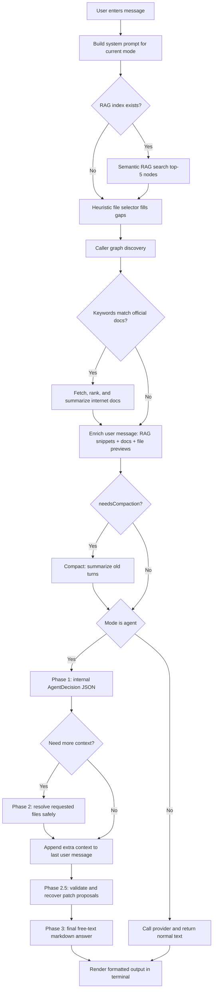
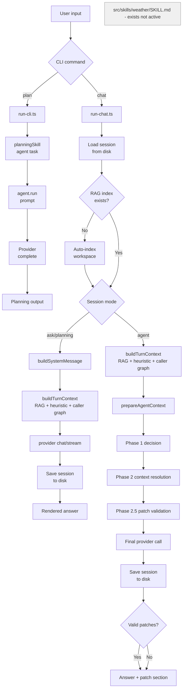

# rei

**REI** is a next-generation, compiler-aware AI Coding Agent built directly for the terminal.
Engineered for privacy, precision, and local-first execution, REI goes far beyond text completion: it builds a **local semantic vector index** of your codebase using AST-level chunking, performs **RAG-powered context retrieval** before every turn, auto-discovers caller files for cascade changes, and runs an **AST Critic Loop** that compiles and self-corrects patches in memory before you ever see them.

## 🌟 Why REI? (Unique Value Proposition)

While commercial giants like Cursor and GitHub Copilot dominate the cloud IDE space, REI takes a radically different "Sniper" approach tailored for the terminal:

- **100% Local & Privacy-First**: No more sending sensitive proprietary code to commercial APIs if you don't want to. REI runs locally using `Ollama` (DeepSeek, Llama 3, Qwen) or any proxy. Your codebase never leaves your firewall.
- **Editor Agnostic**: It lives in the terminal. No need to migrate from WebStorm, Android Studio, Vim, or Emacs. REI operates directly on your filesystem.
- **Local Semantic RAG Index**: REI builds a vector index of your entire codebase using `@xenova/transformers` (ONNX, runs 100% offline). Every function, class, and interface is embedded as a mathematical vector stored in `.rei/rag-index.json`. On each turn, REI finds the most semantically relevant code nodes — not just keyword matches.
- **AST-Level Chunking**: The RAG index is not built from raw text blocks. It uses `ts-morph` to segment the codebase by actual AST nodes (functions, classes, interfaces). Each vector corresponds to a real, named code unit with exact line numbers.
- **Caller Graph Discovery**: When you ask REI to change a function, it automatically scans the workspace for every file that references that symbol and pre-loads them into context — so cascade change proposals cover all affected files without you listing them.
- **The AST Critic Loop (Auto-Healing)**: REI validates LLM-generated patches with the TypeScript compiler in memory. If the model produces broken code, REI feeds the compiler error back to the LLM and forces a correction before showing you anything.
- **Post-Apply Compile Check**: After `/confirm`, REI runs a full `tsc` check across the project (via `ts-morph`) and reports any type errors passively — no shell invocation needed.
- **Persistent Sessions**: Conversations are automatically saved to `.rei/sessions/current.json` and resumed on next launch. Older sessions can be archived and reloaded by ID.
- **Conversation Compaction**: When a session grows beyond 20 messages, older turns are summarized using a configurable cheaper model, keeping context manageable without losing key decisions.
- **Absolute Transparency**: REI logs its entire internal thought process to `.rei/logs/agent-flow.jsonl` — every RAG query, AST extraction, patch proposal, and compiler error, structured as JSON Lines.

## 🎯 Target Audience

- **Privacy-Constrained Enterprises**: Fintech, Defense, Healthcare, and Cybersecurity teams that are legally blacklisted from using Copilot/Cursor due to IP leakage.
- **Unix-Philosophy Developers**: Power users who live in tmux, Vim, and the CLI and refuse bloated GUI IDEs.
- **Local AI Hackers**: Enthusiasts looking to connect their local LLM workflows to their existing repositories efficiently.

## 🌍 Supported Languages & Polyglot Architecture

REI is designed with an elegant degradation architecture. This means it can operate on **any codebase today**, while providing "God Mode" powers to its primary ecosystem:

- **👑 Tier 1: TypeScript & JavaScript (God Mode)**: Full AST Semantic Extraction and Critic Loop Auto-Healing natively using `ts-morph`. The LLM receives strict structural blueprints, and REI compiles the LLM's patches in memory strictly checking for semantic errors before showing you the code.
- **🛠 Tier 2: Python, Go, Java, Rust, PHP, etc. (Standard Mode)**: REI natively indexes all files in your workspace, searching for keywords and context. It behaves exactly like standard Copilot CLI agents, proposing patches based on pure text/prompt understanding.
- **🚀 The v2.0 Roadmap (Universal AST)**: REI's architecture is strictly modular. The next step to making REI the ultimate polyglot expert involves integrating `Tree-Sitter` for universal AST skeleton extraction, and orchestrating native Language Servers (e.g., `mypy`, `go build`, `cargo check`) to execute semantic Critic Loops across all major programming languages!

## Install

```bash
npm install
```

## Commands

Global option:

- `--workspace <path>`: target workspace REI should analyze. Defaults to the current working directory.

### `plan` — one-shot planning

```bash
npm run dev -- plan "create a worktree helper CLI"
```

With explicit workspace:

```bash
npm run dev -- --workspace /workspaces/another-repo plan "create a worktree helper CLI"
```

### `chat` — interactive session

```bash
npm run dev -- chat
```

With explicit workspace:

```bash
npm run dev -- --workspace /workspaces/another-repo chat
```

If only `--workspace` is provided, REI defaults to `chat`:

```bash
npm run dev -- --workspace /workspaces/another-repo
```

### Interactive commands

| Command | Description |
|---|---|
| `/help` | Show available commands |
| `/clear` | Clear conversation history |
| `/exit` | End the session |
| `/mode ask` | Switch to ask mode |
| `/mode planning` | Switch to planning mode |
| `/mode agent` | Switch to agent mode |
| `/pending` | Show currently queued validated patches |
| `/confirm` | Apply all queued patches to the filesystem |
| `/confirm --dry-run` | Validate patches with `git apply --check` without writing |
| `/discard` | Clear queued patches without applying |
| `/index` | Index (or re-index) the workspace for semantic RAG search |
| `/compact` | Manually compact conversation memory into a summary |
| `/session` | Show current session info (created date, mode, turn count) |
| `/session list` | List all archived sessions for this workspace |
| `/session load <id>` | Load an archived session by ID |
| `/session new` | Archive the current session and start a fresh one |

## Modes

REI has three response modes:

- `ask`: explanation and Q&A. Returns a normal text answer.
- `planning`: analysis and implementation planning. Returns a normal text answer.
- `agent`: repository-aware agent flow. Internally performs a context decision step, may ask for more file content, and then returns a normal markdown answer.

The active mode can be changed during a chat session with `/mode <mode>`.

## Model providers

Provider selection is controlled by `MODEL_PROVIDER`:

- `MODEL_PROVIDER=mock`
- `MODEL_PROVIDER=ollama`
- `MODEL_PROVIDER=groq`
- `MODEL_PROVIDER=gemini`
- `MODEL_PROVIDER=openrouter`

### Ollama setup

1. Install Ollama:

```bash
curl -fsSL https://ollama.com/install.sh | sh
```

2. Start the server:

```bash
ollama serve
```

3. Pull a model:

```bash
ollama pull llama3.2
```

4. Run REI:

```bash
MODEL_PROVIDER=ollama OLLAMA_MODEL=llama3.2 npm run dev -- chat
```

Optional configuration:

- `OLLAMA_BASE_URL` default: `http://127.0.0.1:11434`
- `OLLAMA_MODEL` default: `llama3.2`

### Compactor model (optional)

When conversation memory is compacted, REI can use a separate cheaper model for summarization instead of the main provider model. This is useful when the main model is expensive or slow.

```bash
COMPACTOR_MODEL=openai/gpt-4o-mini npm run dev -- chat
```

If not set, the compactor uses the same provider and model as the main session.

### Gemini setup

1. Create an API key in Google AI Studio.
2. Run REI:

```bash
MODEL_PROVIDER=gemini GEMINI_API_KEY=your-key GEMINI_MODEL=gemini-2.5-flash npm run dev -- chat
```

Optional configuration:

- `GEMINI_API_KEY` required
- `GEMINI_MODEL` default: `gemini-2.5-flash`
- `GEMINI_REQUEST_TIMEOUT_MS` default: `120000`

### OpenRouter setup

1. Create an API key at [openrouter.ai/keys](https://openrouter.ai/keys).
2. Run REI:

```bash
MODEL_PROVIDER=openrouter OPENROUTER_API_KEY=your-key npm run dev -- chat
```

To use a specific model:

```bash
MODEL_PROVIDER=openrouter OPENROUTER_API_KEY=your-key OPENROUTER_MODEL=anthropic/claude-3.5-sonnet npm run dev -- chat
```

Optional configuration:

- `OPENROUTER_API_KEY` required
- `OPENROUTER_MODEL` default: `openai/gpt-4o-mini`
- `OPENROUTER_REQUEST_TIMEOUT_MS` default: `120000`

## Terminal output

The interactive chat runs in a full-screen terminal UI (alternate screen buffer) and renders the final answer as formatted markdown:

- headings with ANSI styling
- inline code formatting
- syntax-highlighted code blocks
- preserved markdown structure instead of raw token spam

Input and navigation UX:

- command palette for `/` commands with arrow selection
- `@` mention palette for workspace paths (`Tab` to complete)
- input history (`Up`/`Down`) and reverse search (`Ctrl+R`)
- transcript scrolling (`Ctrl+U`/`Ctrl+D`, `PageUp`/`PageDown`, `Shift+Up`/`Shift+Down`)
- `Esc` closes palettes/search and returns focus to the input

The spinner still runs while the model is generating, and the final formatted answer is printed when the turn completes.

## Repository-aware context

On every user turn, REI rebuilds and injects a rich context bundle into the last user message before calling the provider.

### Turn context pipeline

1. **Workspace scan** — file tree is scanned and cached for 30 seconds.
2. **Semantic RAG search** — the user input is embedded and the top-5 most relevant AST nodes are retrieved from the local vector index. Exact source code is extracted by line number.
3. **Heuristic file selector** — keyword and path scoring fills any gaps left by RAG (de-duplicated, RAG results take priority).
4. **Caller graph discovery** — when the prompt implies a change, REI extracts symbol names and scans the workspace for every file that references them.
5. **External knowledge** — if the prompt triggers a known framework keyword, official docs are fetched and summarized.
6. **Enriched user message** — assembled in priority order: RAG code snippets → external doc summaries → caller file previews → heuristic file previews.

If you include `@path/to/file` in your message, that path is matched during the heuristic step and the file is prioritised. Using `@` for a specific file is always the most reliable way to guarantee it ends up in context.

This context is regenerated on every turn. It is not a one-time snapshot.

### Preview sizes

REI uses different preview sizes depending on mode and user intent:

- default: `900` chars
- agent mode: `4000` chars
- explicit content requests: up to `20000` chars in agent mode

Explicit content requests include prompts such as "exact code", "código exacto", "full code", "contenido completo", or "all functions".

When a preview is cut, REI appends:

```text
... (truncated)
```

That marker is important for the agent decision step.

## Local Semantic RAG Index

REI ships a built-in local vector database stored at `.rei/rag-index.json`. It runs entirely offline using `@xenova/transformers` (`Xenova/all-MiniLM-L6-v2`, ~22 MB, ONNX, cached after first download).

### Building the index

Run `/index` in any chat session to trigger (or re-trigger) indexing. REI walks the workspace using `ts-morph`, extracts every function, class, interface, and variable declaration as an individual chunk, and generates a 384-dimensional embedding vector for each. Non-TypeScript files are indexed as raw text.

Indexing runs asynchronously in-process without blocking the chat. Any previous indexing run is aborted before a new one starts. The index is written atomically to disk (`.tmp` rename) when complete.

### Query-time flow

On every turn, before any LLM call, REI:

1. Embeds the user message with the same ONNX model.
2. Runs cosine-similarity search against all stored vectors (top-5 by default).
3. Maps each result back to exact line numbers in the source file and extracts the verbatim code.
4. Injects the code snippets directly into the user message — not just metadata, but the actual source.

### Storage

```
.rei/
  rag-index.json   — all vectors + metadata (add to .gitignore)
```

The index automatically detects stale entries when files change. Use `/index` to force a full rebuild.

## Session persistence

REI automatically saves the current conversation to `.rei/sessions/current.json` after every turn. On next launch, the session is restored transparently.

### Session format

```json
{
  "version": 1,
  "workspace": "/path/to/project",
  "mode": "agent",
  "createdAt": "2026-04-01T00:00:00.000Z",
  "updatedAt": "2026-04-01T00:00:00.000Z",
  "messages": []
}
```

### Session commands

| Command | Description |
|---|---|
| `/session` | Show current session info |
| `/session list` | List all archived sessions for this workspace |
| `/session load <id>` | Restore an archived session |
| `/session new` | Archive current session and start fresh |

When you run `/session new`, the current session is copied to `.rei/sessions/<timestamp>.json` and a blank session starts.

## Conversation compaction

Long-running sessions accumulate history that eventually exceeds the provider's context window. REI compacts automatically when a session reaches **20 non-system messages**.

### How it works

- The last **8 turns** are kept verbatim (recent context preserved exactly).
- All older turns are summarized into a single synthetic `assistant` message using the configured compactor model.
- The compacted session replaces the in-memory history and is saved to disk.

### Triggering manually

```bash
/compact
```

### Compactor model

```bash
COMPACTOR_MODEL=openai/gpt-4o-mini npm run dev -- chat
```

If `COMPACTOR_MODEL` is not set, the main session provider and model are used.

## External Knowledge Layer

REI features a zero-dependency layer to fetch official documentation when the local model lacks specialized knowledge. This avoids hallucination on framework-specific APIs without needing a fine-tuned model.

### Keyword Domain Detection
When the user's prompt matches a strict set of heuristic triggers (e.g. `signal store`, `zoneless`), REI automatically invokes its internet search pipeline.

### Web Fetching
REI runs concurrent separate queries via a lightweight DuckDuckGo Lite scraper. It targets exclusively official domains. Supported providers currently include:
- **Angular / NgRx / RxJS** (`angular.dev`, `ngrx.io`, `rxjs.dev`)
- **Spring Boot** (`spring.io`)
- **TypeScript** (`typescriptlang.org`)
- **Node.js** (`nodejs.org`)

### Injecting Context
The retrieved HTML pages are cleaned, evaluated, and synthesized using a background model summarizer. The summarized knowledge chunks are then invisibly injected into the main context bundle *before* the model answers the user. The interactive terminal UI displays a `Searching official docs...` spinner while the search resolves.

## Agent mode: current flow

Agent mode no longer uses a user-visible JSON response contract.
Instead, it runs in four phases:

### Phase 1: internal context decision

REI sends a small internal prompt whose only job is to decide:

- is the currently visible context enough?
- is this an inspection task or a change-planning task?
- which additional files are needed, if any?

The model must return a small internal JSON object:

```json
{
  "ready": false,
  "taskType": "inspection",
  "contextRequests": [
    {
      "path": "src/agent-mode/semantic-validation.ts",
      "reason": "need full code to explain all functions"
    }
  ]
}
```

This object is parsed by `parseAgentDecision()` and is never shown to the user.

If parsing fails, REI sanitizes the response, retries with a repair prompt, and eventually falls back to a safe default that skips context expansion.

### Phase 2: deterministic context resolution

If the decision requests more files, REI resolves them without asking the model to guess paths.

Guardrails applied before any file is injected:

- only files already discovered during workspace scanning are allowed
- sensitive filenames and extensions are denied
- symlink escapes outside the workspace are denied
- duplicate requests are ignored
- file reads are capped

Resolved content is appended to the last user message as additional context.

### Phase 2.5: git applicability and validation
For `change-planning` tasks, REI validates model-proposed patches before they are shown as actionable:

- normalize and canonicalize paths/headers
- validate semantics + security
- `git apply --check` test in memory

### Phase 2.6: AST Compiler Guard (The Critic Loop)
If the patch targets TypeScript files (`.ts`, `.tsx`) and passes Git validation, REI invokes an **in-memory TypeScript Compiler (`ts-morph`)**:
1. It copies the file to a `.tmp` location and applies the patch locally.
2. It evaluates `getPreEmitDiagnostics()` on the patched file.
3. If TypeScript throws an error (e.g. `TS2339: Property 'patatita' does not exist`), the patch is marked as `AST_VALIDATION_FAILED`.
4. **Critic Loop**: REI secretly opens a background chat with the LLM, feeds it the compiler error, and demands a corrected patch via search & replace logic. It retries up to 2 times. If the LLM cannot fix the semantic error, the patch is permanently rejected, saving the user from a broken workspace.

Only patches that pass all validation stages (including AST) are queued for `/pending` and `/confirm`.

---

## Patch workflow

When REI is in agent mode and the model proposes file changes, the changes go through a multi-stage pipeline before they can be applied.

### 1. Patch generation

`src/tools/patch-generator.ts` produces unified diff output from before/after string pairs:

- `generateUnifiedDiff(filePath, before, after)` — returns a unified diff string (RFC 3881 format).
- `formatPatchForTerminal(diff)` — colorizes the diff for terminal display (green additions, red deletions, yellow hunk headers, cyan file headers).
- `extractFileFromPatch(patch)` — reads the target file path and hunk count from the diff headers.

### 2. Patch validation

`src/tools/patch-validator.ts` runs a three-stage check before the patch is queued:

**Semantic validation** (`validatePatchSemantics`):
- Patch is non-empty.
- Exactly one `---` / `+++` header pair (multi-file patches are rejected).
- At least one hunk (`@@` header).
- No merge conflict markers (`<<<<<<<`, `=======`, `>>>>>>>`).

**Security validation** (`validateFileTarget`, from `file-security.ts`):
- Target file is inside the workspace.
- Target is inside an allowed directory (`src/`, `prompts/`, `docs/`).
- Target is not a denied file (`package.json`, `tsconfig.json`, `.env`, lock files, etc.).
- No symlink traversal.

**Git applicability check** (`validatePatchWithGit`):
- Runs `git apply --check` on the patch without writing to disk.
- Confirms the patch applies cleanly to the current working tree.

Only patches that pass all three stages are enqueued.

### 3. Patch queue

Validated patches are stored in memory on the `Agent` instance as `AgentProposedPatch[]`. The queue survives across turns until explicitly confirmed or discarded.

```
/pending        — inspect queue (shows colorized diff)
/confirm        — apply all queued patches to disk
/confirm --dry-run — re-run git apply --check without writing
/discard        — drop all pending patches
```

### 4. Patch application

`src/tools/patch-applier.ts` applies the queue through `git apply`:

- `applyPatchToFS(patchText, workspacePath, { dryRun })` — writes the patch to a temp file and runs `git apply` (or `git apply --check` for dry-run). Cleans up the temp file regardless of outcome.
- `applyPatchBatch(proposals, workspacePath, options)` — iterates the queue, re-validates each patch, and calls `applyPatchToFS` per entry. Returns a `BatchPatchApplyResult` with per-file status.

After a successful real apply (`dryRun: false`, all entries applied), the queue is automatically cleared.

### Phase 3: final free-text answer

After the extra context is injected, REI performs the final provider call and returns a normal markdown answer.

Important properties of the final phase:

- no top-level JSON contract
- no user-visible orchestration object
- inspection tasks can show exact code from the visible context
- change-planning tasks can describe concrete edits and risks
- the final text is what the terminal renders and what the user sees

In other words:

- the internal JSON exists only to negotiate context
- the visible answer comes from the final free-text provider call

## How REI decides it needs more context

The key signal is whether the currently visible preview is sufficient for the request.

Typical examples where REI should request more context:

- the user asks for exact code and the preview ends with `... (truncated)`
- the user asks to explain all functions in a file but only part of the file is visible
- the user asks for a modification plan that depends on code paths not yet visible

Typical examples where REI should answer immediately:

- the selected previews already include the relevant function or type in full
- the user asks a high-level question that does not require reading a whole file

## Message trimming

REI keeps full chat history in memory, but sends only a reduced window to the provider.

Current limits by mode:

- `ask`: last `14` non-system messages
- `planning`: last `10` non-system messages
- `agent`: last `10` non-system messages

The system message is always preserved.
Repository context is re-injected each turn, so trimming older turns does not remove workspace grounding.

## Prompt system

The main system prompt is built in two different ways:

### Regular modes

For `ask` and `planning`, `buildSystemMessage(mode)` composes:

1. shared base prompt
2. shared response rules
3. mode-specific prompt
4. mode-specific output format

### Agent mode

Agent mode uses two prompts depending on the phase:

- decision phase: shared base prompt + `agent-decision`
- answer phase: shared base prompt + shared response rules + `agent-answer`

This split is what lets REI keep the orchestration contract internal while still returning normal markdown to the user.

## Debug output

Each turn prints a brief context summary, and agent mode also prints internal decision logs.

Example:

```text
[REI debug] Workspace: /path/to/project
[REI debug] Relevant files selected: 3
  - src/core/agent.ts (score: 6)
  - src/prompts/prompt-builder.ts (score: 4)
  - README.md (score: 2)
[REI debug] Agent decision: taskType=inspection, ready=false, contextRequests=[src/foo.ts]
[REI debug] Agent context resolved 1 file(s), injecting into answer phase
```

## Current limitations

- patch proposals are only applied manually through `/confirm` (explicit approval gate)
- model-proposed diffs may still be rejected if validation or `git apply --check` fails
- no built-in command-execution toolchain inside REI runtime yet (focus is context + patch workflow)
- RAG index must be rebuilt manually after large refactors (`/index`)
- external knowledge providers cover a limited set of frameworks

## Next steps

Near-term priorities:

1. `/review` command — structured code review output (critical / warning / suggestion) per file or directory
2. make `@` mentions first-class context pins (pre-loaded before RAG, not part of heuristic scoring)
3. incremental RAG index updates (watch mode, re-embed only changed files)
4. add richer patch diagnostics/fix suggestions when validation fails

## Diagnostic Traceability (Logging)

REI records every turn's internal operations to a zero-dependency append-only JSON Lines file located at `.rei/logs/agent-flow.jsonl`. 
Because Agent Mode has internal hidden loops (Phase 1 Decision, Phase 2.6 Critic Loop), this log is vital for transparency. It records:
- The exact raw output from the LLM before JSON parsing.
- The external URLs scraped by the Knowledge Orchestrator.
- The exact raw strings of patches.
- The TypeScript Compiler errors caught during the AST Guard phase.

## Testing

REI uses **Vitest** for extreme execution speed and ESM compatibility. 

To run the unit test suites:
```bash
npm run test
```
To run in watch mode:
```bash
npm run test:watch
```
To trigger a full TypeScript type check without emitting:
```bash
npm run check
```

## Runtime overview



## Agent loop and skills

Current skill activation is explicit, not generic.

- `planningSkill` is invoked directly by the `plan` CLI command.
- `src/skills/weather/SKILL.md` exists in the repository, but it is not auto-dispatched by the current chat or agent runtime.



## Documentation rule

When core runtime behavior changes, update the README in the same change set.
