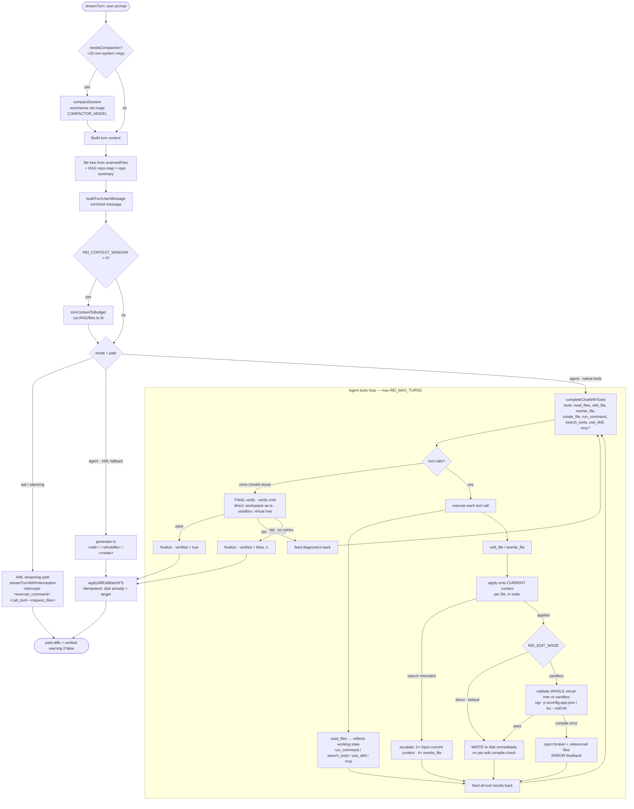

# REI — Agent Loop

How a single `agent.streamTurn()` turn flows. The diagram focuses on the **native tools
path** (primary, used by tool-capable local models like Qwen); ask/planning and the XML
fallback are shown as branches.



## Edit lifecycle (request → modify → verify → persist)

The **default `direct` mode** works like a human/CLI agent (this is the flow that fixed the
edit-loop death-spirals local models hit):

1. **Request context** — the model calls `read_files` (often several in parallel). It reflects
   the real working state, so re-reads show the model its own changes, not stale disk.
2. **Modify** — `edit_file` / `rewrite_file` are applied **straight to disk**, in order. A
   `<search>` that doesn't match the current content is a mismatch → escalation (2× inject the
   exact current content, 4× switch to `rewrite_file`).
3. **Self-verify** — the model runs `run_command` (`tsc`/`ngc`/tests) **whenever it judges it's
   done a coherent unit**, and sees its real edits on disk (no divergence — the bug that made
   the model think "my edits didn't apply" and spiral).
4. **Final verify** — when the model emits a plain-text answer (done), REI runs **one** verify
   of the workspace as-is (honest `verified` flag). On failure it feeds the diagnostics back —
   including the broken file(s) and any module they reference (`resolveReferencedFiles`) — for
   self-correction, bounded by `verifyRetries`.
5. **Done** — edits are already on disk; `applySREditBatchFS` is an idempotent no-op that still
   yields the diffs for display.

> **`sandbox` mode** (opt-in) inserts a guard between steps 2 and 3: each edit is applied to a
> **virtual working tree** (`Map<file, content>`) and the *whole tree* is validated against a
> throwaway sandbox; only **green** state is persisted to disk. It never leaves broken code on
> disk but copies the workspace per edit and tends to saturate local models. See *Edit modes*.

## Edit modes (`REI_EDIT_MODE`)

Two ways the loop turns model edits into validated files on disk:

- **`direct`** (DEFAULT, "Claude Code style") — edits are applied **straight to disk**, with
  **no per-edit compile-check**. The model self-verifies via `run_command` (it sees the real
  disk) and REI runs **one final verify** when the model finishes (sandbox copy of the current
  disk, i.e. `validateProposedPatches({edits: []})`), feeding errors back for self-correction.
  **Lighter** (no per-edit sandbox copies) and avoids the reject-per-edit loop — at the cost of
  leaving partial edits on disk if the task aborts (recoverable via git). Search-mismatch
  detection still runs (against real disk, so it's accurate).
- **`sandbox`** (opt-in, `REI_EDIT_MODE=sandbox`) — the virtual-tree flow above: every edit is
  validated against the **cumulative** tree in a throwaway sandbox, and only **green** state is
  persisted. Never leaves broken code on disk, but each validation **copies the workspace** and
  the reject-per-edit pressure tends to **saturate local models** (the loop they got stuck in).

`direct` is the default because it works for both local and cloud models. Reach for `sandbox`
only when "never touch disk until it's green" outweighs speed (e.g. a very weak model with no
git safety net).

## Key gates & guardrails

- **Compaction** (count-based, &gt;20 msgs) — the only context guardrail active when
  `REI_CONTEXT_WINDOW=0`; trimming + overflow warning need a non-zero window.
- **Compile/type verification** — runs the project's verify command (below). In `direct` mode:
  the model self-verifies + one final verify. In `sandbox` mode: every edit validates the whole
  cumulative tree. Either way the AST/compile strength is intact — only the timing differs.
- **Verify command** is project-type aware (`project-type.ts`): Angular → `ngc` (catches
  template errors), plain TS → `tsc --noEmit`. (`REI_TDD_MODE=true` appends `npm run test`.)
- **Search-mismatch escalation:** 2 mismatches → inject exact current content; 4 → `rewrite_file`.
- **Referenced-file injection** (`resolveReferencedFiles`, per-language adapter): a compile
  error naming another module (e.g. TS2305 "no exported member") injects that file so the model
  edits provider + consumer together. TS/Angular implemented; C# falls back to the generic
  "file where the error appears".
- **Skills:** `use_skill` loads a recipe on demand, **mode-scoped** via `modes:` frontmatter.
  Native loop exposes agent-mode skills in the tool schema; ask/planning inject the mode's
  catalog and invoke via `<call_tool name="use_skill">`. SDD chain (`[planning]`):
  `write-spec` → `micro-task-decomposition` → `/runplan` → verify.
- **run_command** is for exploration/verification; it now sees on-green edits. `rm -rf` blocked.

## Trade-offs & known limitations (for review)

- **Apply-on-green persists partial work**: if a task ultimately fails/aborts, the green edits
  already written to disk remain (recoverable via git). This mirrors how a human/CLI agent
  works and is the cost of letting the model verify its own work mid-turn.
- `verified: true` means "what was applied compiles", NOT "task complete".
- In-loop `read_files` accumulation is not budget-controlled (can grow the window mid-turn).
- ask/planning use the XML path → a tool-trained model may leak native `<tool_call>` syntax
  (stripped via `stripNativeToolSyntax`); that path does **not** use the virtual tree.
- agent-flow logging does not capture streamed text for ask/planning (hard to analyze post-hoc).
```
