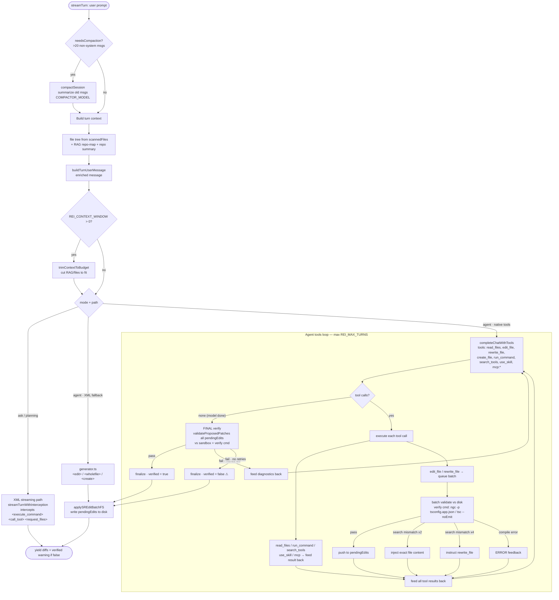

# REI — Agent Loop

How a single `agent.streamTurn()` turn flows today. The diagram focuses on the
**native tools path** (primary, used by tool-capable local models like Qwen);
ask/planning and the XML fallback are shown as branches.

## Key gates & guardrails

- **Compaction** (count-based, &gt;20 msgs) — the only context guardrail active when
  `REI_CONTEXT_WINDOW=0`; trimming + overflow warning need a non-zero window.
- **Per-batch validation** (against on-disk content — what the model sees) + **final
  combined verify** before applying. `verified` reflects the real compiler result.
- **Verify command** is project-type aware (`project-type.ts`): Angular → `ngc` (catches
  template errors), plain TS → `tsc --noEmit`.
- **Search-mismatch escalation:** 2 mismatches → inject the file; 4 → switch to `rewrite_file`.
- **Skills:** `use_skill` loads a recipe on demand (catalog always present, body only when invoked).
- **run_command** is for exploration/verification; destructive `rm -rf` is blocked.

## Known limitations (for review/improvement)

- `verified: true` means "what was applied compiles", NOT "task complete".
- In-loop `read_files` accumulation is not budget-controlled (can grow the window mid-turn).
- ask/planning use the XML path → a tool-trained model may leak native `<tool_call>` syntax
  (tolerated/stripped by the streamer).
- agent-flow logging does not capture streamed text for ask/planning (hard to analyze post-hoc).
