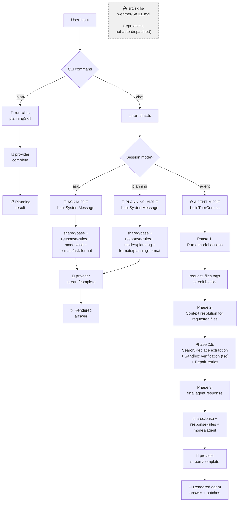

# Prompt Architecture

This document explains how REI assembles system prompts, how modes are wired, where skills fit today, and how to modify behavior safely.

---

## Overview

REI uses a hybrid prompt system:

- **Markdown files** hold human-readable instructions that can be edited without touching TypeScript.
- TypeScript orchestration assembles the sections in the correct order and chooses the correct prompt path for each mode and agent phase.

---

## File Layout

```
prompts/
  shared/
    base.md             ← Core identity and hallucination-prevention rules (all modes)
    response-rules.md   ← General response formatting rules (all modes)
  modes/
    ask.md              ← Instructions for ASK mode
    planning.md         ← Instructions for PLANNING mode
    agent-answer.md     ← Final answer instructions for AGENT mode
    agent-decision.md   ← Internal context-decision instructions for AGENT mode
  formats/
    ask-format.md       ← Preferred response structure for ASK mode
    planning-format.md  ← Preferred response structure for PLANNING mode

src/
  prompts/
    loader.ts           ← Reads markdown files from disk; in-memory cache
    prompt-builder.ts   ← Assembles standard prompts and agent-phase prompts

AGENTS.md               ← High-level description of REI, behavior rules, modes

src/skills/
  planning-skill.ts     ← Explicit CLI skill wrapper used by the plan command
  weather/SKILL.md      ← Skill asset present in repo, not wired into runtime dispatch
```

---

## Prompt Assembly Order

For ask and planning modes the system prompt is built as:

```
[shared/base]
<blank line>
Active mode: <mode>
<blank line>
[shared/response-rules]
<blank line>
[modes/<mode>]
<blank line>
[formats/<mode>-format]
```

This is orchestrated by `buildSystemMessage(mode)` in `src/prompts/prompt-builder.ts`.

For agent mode, REI uses two prompt paths instead of one:

### Agent decision phase

```
[shared/base]
<blank line>
Active mode: agent (context evaluation)
<blank line>
[modes/agent-decision]
```

Built by `buildAgentDecisionSystemMessage()`.

### Agent answer phase

```
[shared/base]
<blank line>
Active mode: agent
<blank line>
[shared/response-rules]
<blank line>
[modes/agent-answer]
```

Built by `buildSystemMessage("agent")`.

---

## Loader

`src/prompts/loader.ts` exposes one public function:

```ts
loadPrompt(section: string): string
```

- `section` is a path **relative to the `/prompts` root**, without the `.md` extension.
  - Examples: `"shared/base"`, `"modes/ask"`, `"formats/planning-format"`.
- Reads the file synchronously on first access; subsequent calls return the cached string.
- Call `clearPromptCache()` if you need to reload from disk (useful in tests).

---

## Agent Action Contract

REI agent mode uses an XML-based action protocol, not JSON. The model communicates intent via two XML tags:

**Requesting files:**
```
<request_files>src/path/to/file1.ts, src/path/to/file2.ts</request_files>
```
The pipeline calls `extractFileRequests()` in `src/agent-mode/response-handler.ts` and injects resolved file contents into the next model message.

**Proposing edits:**
```xml
<edit file="src/path/to/file.ts">
<search>exact lines to replace</search>
<replace>new lines</replace>
</edit>
```
The pipeline calls `extractSREdits()` in `src/agent-mode/response-handler.ts`, applies them in a sandbox, and runs `npx tsc --noEmit` for verification.

`src/contracts/agent-decision.types.ts` does not describe the current agent loop. It is a legacy artefact not used by the XML-based pipeline.

## Skills In The Current Runtime

Skill handling is currently explicit and limited.

- `planningSkill` is invoked directly from the `plan` CLI command in src/cli/run-cli.ts.
- `src/skills/weather/SKILL.md` exists as a repository skill asset.
- There is no generic skill router in the chat session loop.
- Agent mode does not currently inspect the user request and auto-dispatch to repo skills.

This means prompts, modes, and skills are separate concerns today:

- modes drive prompt assembly and chat behavior
- the plan command can call a hard-coded skill wrapper
- repo skill files are present, but not yet part of a runtime dispatch layer

## Prompt, Mode, And Skill Flow



---

## How to Add a New Mode

1. **Add the mode value** to `SessionMode` in `src/chat/types.ts`:
   ```ts
   export type SessionMode = "ask" | "planning" | "agent" | "your-mode";
   ```

2. **Create the instruction file** `prompts/modes/your-mode.md`.

3. **Create the format file** `prompts/formats/your-mode-format.md`.

4. **Update the CLI** — add the new mode to `MODE_PROMPTS` in `src/cli/run-chat.ts` and to the
   mode-switch validation in the same file.

5. If the mode needs a special multi-phase flow, add a dedicated builder path in `src/prompts/prompt-builder.ts` and wire it from the runtime.

---

## How to Modify Behavior Safely

| Goal                                       | What to edit                                      |
|--------------------------------------------|---------------------------------------------------|
| Change wording of base identity rules      | `prompts/shared/base.md`                          |
| Change general response formatting rules   | `prompts/shared/response-rules.md`                |
| Change ask/planning mode behavior          | `prompts/modes/<mode>.md`                         |
| Change ask/planning response structure     | `prompts/formats/<mode>-format.md`                |
| Change agent decision behavior             | `prompts/modes/agent-decision.md`                 |
| Change agent final answer behavior         | `prompts/modes/agent-answer.md`                   |
| Change agent decision schema               | `src/contracts/agent-decision.types.ts`           |
| Change prompt assembly order               | `src/prompts/prompt-builder.ts`                   |
| Add real runtime skill dispatch            | CLI/chat runtime + skill loading/orchestration    |

Markdown files are loaded at runtime, so changes take effect on the next process start without recompiling. TypeScript wiring changes should be validated with `npm run check`.
